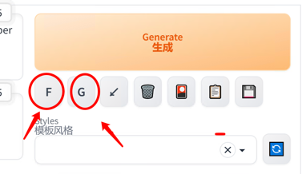
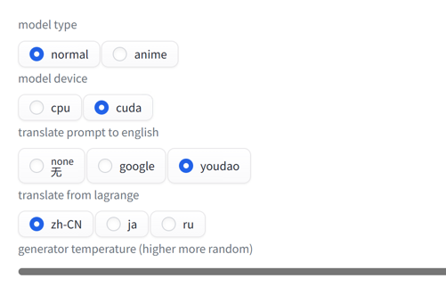

# sd-webui-prompt-generator

## README Translation

-   [English](README.en.md)
-   [Simplified Chinese](README.md)
-   [Japanese](README.ja.md)
-   [Russian](README.ru.md)

## Overview

Generator Prompt was created to help you create a prompt for your.

-   Translate Prompt to English
-   Small and fast Prompt generative model
-   Automatically generate more details for Prompt
    -   standard mode
    -   Two-dimensional (animation) mode
-   Automatically Format Prompts

## Usage

-   `F`button formatting
-   `G`Button translate + generate

### Model download

model automatically from[拥抱脸](https://huggingface.co/)Download, if the network is not good, you can download it manually[Baidu](https://pan.baidu.com/s/1RRo30reGmhRzFlGrZG74tg?pwd=mh96)

-   offline download
    -   [Baidu](https://pan.baidu.com/s/1RRo30reGmhRzFlGrZG74tg?pwd=mh96)Extraction code: mh96
    -   extract to`stable-diffusion-webui\models`

-   Model official website
    -   [anime-anything-promptgen-v2](https://huggingface.co/FredZhang7/anime-anything-promptgen-v2)
    -   [distilgpt2](https://huggingface.co/distilgpt2)
    -   [distilgpt2-stable-diffusion-v2](https://huggingface.co/FredZhang7/distilgpt2-stable-diffusion-v2)

## settings

-   `model type`
    -   `normal`general pattern
    -   `anime`Two-dimensional
-   `model device`
    -   `cpu`Does not occupy video memory, slightly slower
    -   `cuda`memory usage, fast
-   `translate `
    -   `none`don't translate
    -   `google`Google Translate
    -   `youdao`Youdao translation
-   `translate from`
    -   `zh`Chinese
    -   `jp`Japanese
    -   `ru`Russian
-   `genertor temperature`Generate temperature, 0.0-1.0, the higher the more random

