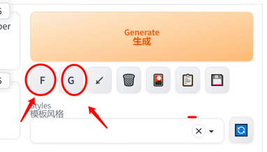

# sd-webui-prompt-generator

## README Translation

- [English](README.en.md)
- [简体中文](README.md)
- [Japanese](README.ja.md)
- [Russian](README.ru.md)

## Overview

Generator Prompt was created to help you create a prompt for your. 

* 翻译Prompt到英文
* 小而快的Prompt生成模型
* 自动为Prompt生成更多细节
  * 标准模式
  * 二次元（动画）模式
* 自动格式化Prompt

## Usage

* `F`按钮格式化
* `G`按钮翻译+生成

### 模型下载

模型自动从[拥抱脸](https://huggingface.co/)下载，如果网络不好，可以手动下载[Baidu](https://pan.baidu.com/s/1RRo30reGmhRzFlGrZG74tg?pwd=mh96)

* 离线下载
  * [Baidu](https://pan.baidu.com/s/1RRo30reGmhRzFlGrZG74tg?pwd=mh96) 提取码: mh96
  * 解压到`stable-diffusion-webui\models`

* 模型官网
  * [anime-anything-promptgen-v2](https://huggingface.co/FredZhang7/anime-anything-promptgen-v2)
  * [distilgpt2](https://huggingface.co/distilgpt2)
  * [distilgpt2-stable-diffusion-v2](https://huggingface.co/FredZhang7/distilgpt2-stable-diffusion-v2)

## settings

* `model type`
  * `normal` 一般模式
  * `anime` 二次元
 * `model device`
   * `cpu` 不占用显存、稍慢
   * `cuda` 占用显存、快
 * `translate ` 
   * `none` 不翻译
   * `google` 谷歌翻译
   * `youdao` 有道翻译
* `translate from`
  * `zh` 中文
  * `jp` 日文
  * `ru` 俄文
* `genertor temperature` 生成温度, 0.0-1.0,越高越随机

