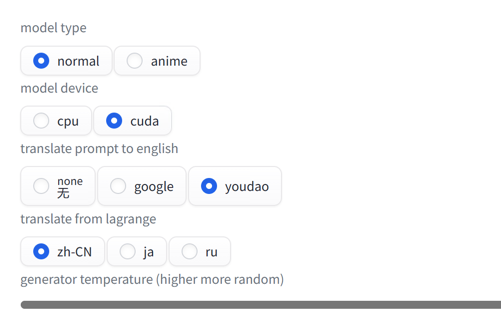

# sd-webui-prompt-генератор

## README Перевод

-   [Английский](README.en.md)
-   [Упрощенный китайский](README.md)
-   [Японский](README.ja.md)
-   [Русский](README.ru.md)

## Обзор

Генератор подсказок был создан, чтобы помочь вам создать подсказку для вашего.

-   Перевести подсказку на английский
-   Маленькая и быстрая генеративная модель Prompt
-   Автоматически генерировать дополнительные сведения для подсказки
    -   стандартный режим
    -   Двухмерный (анимационный) режим
-   Автоматически форматировать подсказки

## Применение

-   `F`форматирование кнопки
-   `G`Кнопка перевести + сгенерировать

### 模型下载

модель автоматически из[обнять лицо](https://huggingface.co/)Скачать, если сеть плохая, можно скачать вручную[Байду](https://pan.baidu.com/s/1RRo30reGmhRzFlGrZG74tg?pwd=mh96)

-   автономная загрузка
    -   [Байду](https://pan.baidu.com/s/1RRo30reGmhRzFlGrZG74tg?pwd=mh96)Код извлечения: mh96
    -   извлечь в`stable-diffusion-webui\models`

-   Официальный сайт модели
    -   [аниме-что-нибудь-promptgen-v2](https://huggingface.co/FredZhang7/anime-anything-promptgen-v2)
    -   [дистилляция2](https://huggingface.co/distilgpt2)
    -   [distilgpt2-стабильная диффузия-v2](https://huggingface.co/FredZhang7/distilgpt2-stable-diffusion-v2)

## настройки

-   `model type`
    -   `normal`общая схема
    -   `anime`Двумерный
-   `model device`
    -   `cpu`Не занимает видеопамять, чуть медленнее
    -   `cuda`использование памяти, быстро
-   `translate `
    -   `none`не переводи
    -   `google` 谷歌翻译
    -   `youdao`Юдао перевод
-   `translate from`
    -   `zh`Китайский
    -   `jp`Японский
    -   `ru`Русский
-   `genertor temperature` 生成温度, 0.0-1.0,越高越随机

